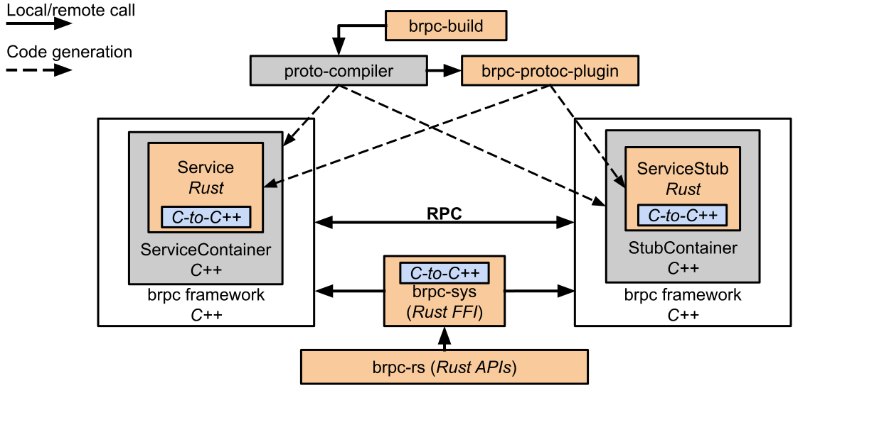

<p align="center"></p>
<h1 align="center"> brpc-rs: Apache BRPC library for Rust </h1>

[](https://travis-ci.com/mesalock-linux/brpc-rs)
[](https://crates.io/crates/brpc-rs)
[](https://docs.rs/brpc-rs/)

[Apache BRPC](https://github.com/apache/incubator-brpc) is an industrial-grade
RPC framework for building reliable and high-performance services. `brpc-rs` enables BRPC clients and servers implemented in the Rust programming language.

`brpc-rs` is part of the [MesaLock Linux](https://github.com/mesalock-linux)
Project.

## Status

This project is currently a prototype under active development. Many APIs are
missing; the provided APIs are not guaranteed to be stable until 1.0.


## Repository structure
+ Project root
    + brpc-build
        - [brpc-build](https://crates.io/crates/brpc-build) crate, build-time
          code generator
    + brpc-protoc-plugin
        - [brpc-protoc-plugin](https://crates.io/crates/brpc-protoc-plugin)
          crate, plugin for Google Protobuf compiler
    + brpc-sys
        - [brpc-sys](https://crates.io/crates/brpc-sys) crate, FFI bindings to
          Apache BRPC
    + examples
        - examples
    + src
        - [brpc-rs](https://crates.io/crates/brpc-rs) crate, Rust APIs for
          `brpc-rs`

This graph illustrates how the crates work together:
<p align="center"></p>

## Quickstart

### Prerequisites

First **build** and **install** Apache BRPC. Instructions can be found in
[getting_started.md](https://github.com/apache/incubator-brpc/blob/master/docs/cn/getting_started.md).

Alternatively, you may use the prebuilt deb packages of Apache BRPC 0.9.6 for
Ubuntu
[16.04](https://brpc-rs.s3-us-west-1.amazonaws.com/brpc_prebuilt/brpc-0.9.6_x86_64_xenial.deb)/[18.04](https://brpc-rs.s3-us-west-1.amazonaws.com/brpc_prebuilt/brpc-0.9.6_x86_64_bionic.deb).
These are NOT official packages.

Make sure these dependencies are already installed:

```
$ sudo apt-get install libprotobuf-dev libprotoc-dev protobuf-compiler
$ sudo apt-get install libssl-dev libgflags-dev libleveldb-dev
```

Install `brpc-protoc-plugin` from crates.io.

```shell
$ cargo install brpc-protoc-plugin
```

Now we are ready to start a `brpc-rs` project.

### Cargo.toml

Let's create a small crate, `echo_service`, that includes an `echo_client` and
an `echo_server`.

```shell
$ cargo new echo_service && cd echo_service
```

In `Cargo.toml` , add `brpc-rs`, `prost` and `bytes` to the `[dependencies]`
section; add `brpc-build` to the `[build-dependencies]` section. For example,

```toml
[build-dependencies]
brpc-build = "0.1.0"

[dependencies]
brpc-rs = "0.1.0"
prost = "0.5.0"
bytes = "0.4.12"
```

Define two binaries: `echo_client` and `echo_server` in `Cargo.toml`

```toml
[[bin]]
name = "echo_client"
path = "src/client.rs"

[[bin]]
name = "echo_server"
path = "src/server.rs"
```

### build.rs

Put a protobuf file `echo.proto` in `src`. This file defines `EchoRequest`,
`EchoResponse` and `EchoService`.

```protobuf
syntax="proto2";
package example;
message EchoRequest {
      required string message = 1;
};
message EchoResponse {
      required string message = 1;
};
service EchoService {
      rpc echo(EchoRequest) returns (EchoResponse);
};
```


Add a line `build = "build.rs"` in the `[package]` section in `Cargo.toml`.
Then, create a file called `build.rs` to generate bindings from
`src/echo.proto`.

```rust
fn main() {
    brpc_build::compile_protos(&["src/echo.proto"],
                               &["src"]).unwrap();
}
```

Note the `package` name in `echo.proto` is `example`. So `build.rs` would generate two files named `example.rs` and `example.brpc.rs`.


### src/server.rs

Next let's implement the echo server. Create `src/server.rs` as follows:

```rust
use brpc_rs::{Server, ServerOptions, ServiceOwnership};

pub mod echo {
    include!(concat!(env!("OUT_DIR"), "/example.rs"));
    include!(concat!(env!("OUT_DIR"), "/example.brpc.rs"));
}

fn main() {
    let mut service = echo::EchoService::new();
    service.set_echo_handler(&mut move |request, mut response| {
        response.message = request.message.clone();
        Ok(())
    });

    let mut server = Server::new();
    let mut options = ServerOptions::new();
    options.set_idle_timeout_ms(1000);
    server
        .add_service(&service, ServiceOwnership::ServerDoesntOwnService)
        .expect("Failed to add service");
    server.start(50000, &options).expect("Failed to start service");
    server.run(); // Run until CTRL-C
}
```

Because `EchoService` defines a function called `echo()` in `echo.proto`, the
`brpc-protoc-plugin` generates the Rust definition of `set_echo_handler()` for
`EchoService`. `set_echo_handler()` accepts a closure which handles
`EchoRequest` sent from clients and returns an `EchoResponse` with the same
message. The remaining lines create a server that listens at `0.0.0.0:50000`.


### src/client.rs

```rust
use brpc_rs::{Channel, ChannelOptions};

pub mod echo {
    include!(concat!(env!("OUT_DIR"), "/example.rs"));
    include!(concat!(env!("OUT_DIR"), "/example.brpc.rs"));
}

fn main() {
    let mut options = ChannelOptions::new();
    options.set_timeout_ms(100);
    let addr = "127.0.0.1:50000".parse().expect("Invalid socket address");
    let ch = Channel::with_options(&addr, &options);
    let client = echo::EchoServiceStub::with_channel(&ch);
    let request = echo::EchoRequest {
        message: "hello".to_owned(),
    };
    match client.echo(&request) {
        Ok(r) => println!("Response: {:?}", r),
        Err(e) => eprintln!("Error: {:?}", e),
    }
}
```

The client first creates a `Channel` and initializes a `service_stub` with that
channel. The client then calls `service_stub.echo()` to send a request..


### Running the client and server

```shell
$ cargo run --bin echo_server &
$ cargo run --bin echo_client
Response: EchoResponse { message: "hello" }
```


## Maintainer

 * Yiming Jing `<jingyiming@baidu.com>` [@kevinis](https://github.com/kevinis)

## License
`brpc-rs` is provided under Apache License, Version 2.0. For a copy, see the
LICENSE file.
